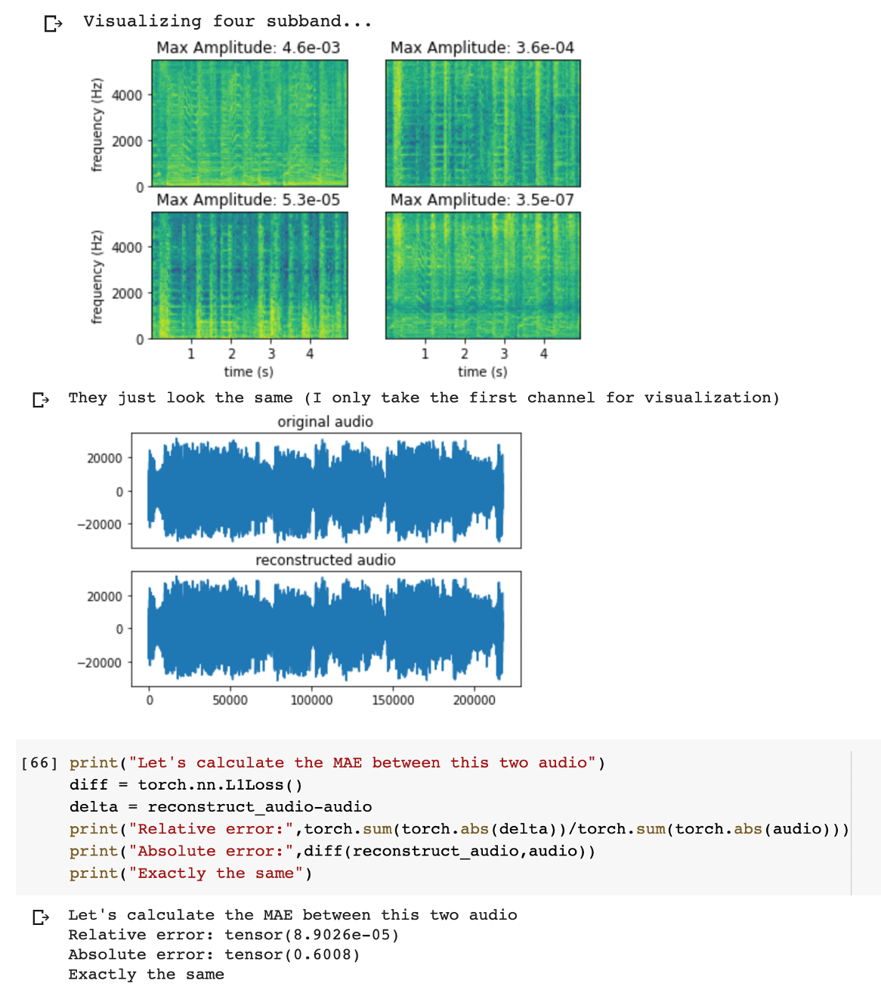
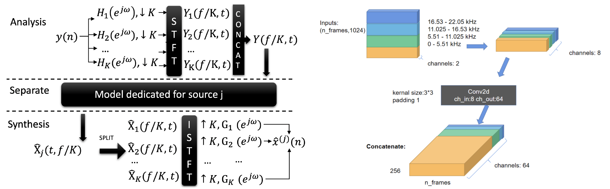
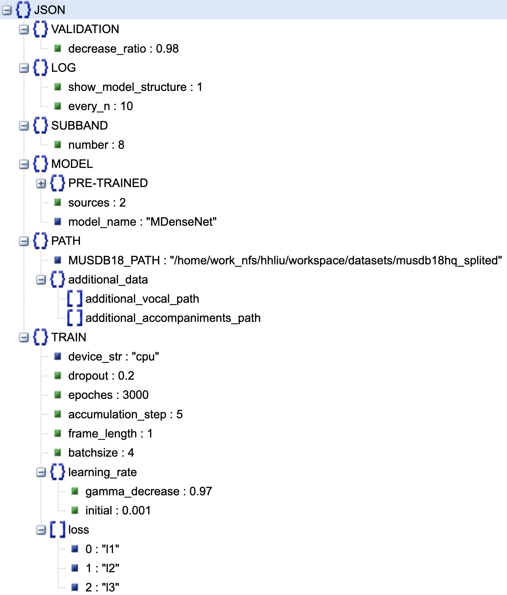
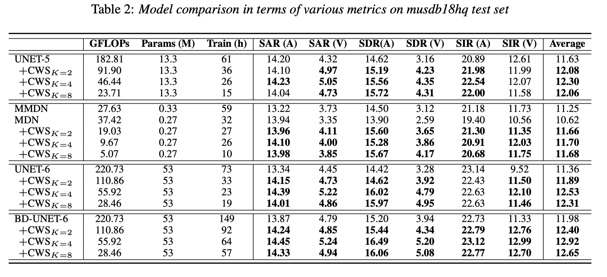
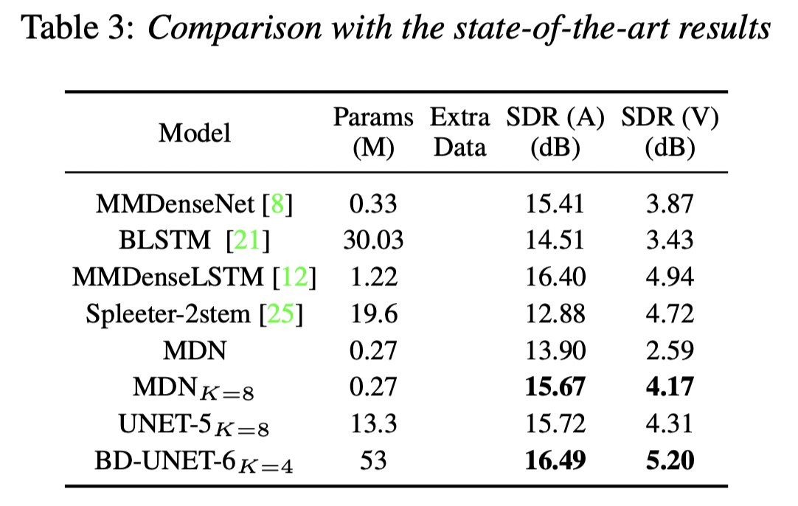

# Update on 2020.08.08
I wrote a script on google colab. It's a demo for my **subband related code** with detailed comment and visualization. Come and check it out!

> https://colab.research.google.com/drive/1n2ed4ucPEqTTV4MVa-FXyLzeDweBIoex?usp=sharing



## Citation

If you find our code useful for your research, please consider citing:

>    @inproceedings{Liu2020,
>      author={Haohe Liu and Lei Xie and Jian Wu and Geng Yang},
>      title={{Channel-Wise Subband Input for Better Voice and Accompaniment Separation on High Resolution Music}},
>      year=2020,
>      booktitle={Proc. Interspeech 2020},
>      pages={1241--1245},
>      doi={10.21437/Interspeech.2020-2555},
>      url={http://dx.doi.org/10.21437/Interspeech.2020-2555}
>    }.

# Subband Music Separation

This is a system for voice and accompaniment separation model training. All you need to do is configure environment, download training data and enjoy your training! If you need personalize your training, you just need to modify the configurationjson file. We also provide some examples. This repo also integrate the subband decomposation and synthesis tools mentioned in our paper: [link](https://arxiv.org/abs/2008.05216) 

- You can use MUSDB18 **[1]** as well as the data you have

- You can easily try  Channel-wise subband (CWS) input **[2]** by modify the configuration file

- You can use model we pre-defined. You can also add model if you like!

  ...



## 1. Quick start

- First we configure the code running environments

  ```shell
  git clone https://github.com/haoheliu/Subband-Music-Separation.git
  pip install -r requirements.txt
  ```

- Then we download musdb18-hq data from the following website, this process might be a little bit slow.

  >  https://zenodo.org/record/3338373#.Xu8CqS2caCM

  Note: You can also use your own data, see: [link](#additional-data)

- Next we configure the path to MUSDB18 dataset

  - We open the [config.json](#Config) (or other config file you like)
  - Modify the "MUSDB18_PATH" variable; e.g.: "/home/work_nfs/hhliu/workspace/datasets/musdb18hq_splited"
  - Save file

- Finanlly let training! 

  ```java
  python main_separation.py config.json
  ```

  

## 2. Demos

You can play with some additional functions by modify the configuratoin file or use the code we provide. 

- **Load pre-trained model and start training(MMDenseNet)**

  - Configure model structure (*examples/config_demo_pretrained.json*)

  - Configure pretrained model path (*examples/config_demo_pretrained.json*)

    ```json
    "PRE-TRAINED": {
      "start_point": 155700,
      "load_model_path": "./checkpoints/1_2020_5_8_MDenseNetspleeter_sf0_l1_l2_l3__BD_False_lr001_bs16-1_fl1.5_ss4500.0_87lnu4fshift8flength32drop0.1split_bandTrue_8"
    },
    ```

    ```java
    python main_separation.py examples/config_demo_pretrained.json
    ```

    

- **Separate a song (Using MMDenseNet)**

  - Put the song you'd like to split in: "./evaluate/listener_todo"

    ```java
    python demo_separation.py
    ```

    

- <span id='additional-data'>**Use additional data**</span> 

  - Do configuration like below. List all the path to each of your .wav file in those txt files.

    ```json
        "additional_data": {
          "additional_vocal_path": ["addtional_data/accompaniment_list1.txt",
                                    "addtional_data/accompaniment_list2.txt"], 
          "additional_accompaniments_path": ["addtional_data/vocal_list1.txt",
                                             "addtional_data/vocal_list2.txt"] 
        }
    ```

- **Try different kinds of Channel-wise subband inputs**

  - Modify the "SUBBAND-number" parameter, the value you can choose is 1,2,4,8
  
    ```json
    "SUBBAND": {
      "number": 8 
    },
    ```

<h2 id="Config">3. About the config file</h2>

You just need to mofidy the configuration file to personalize your experiment. This section I will lead you around the variable inside the configuration file. The content inside the configuration file is shown below: 



**The function of each parameter:** 

- **LOG**
  - **show_model_Structure**:  int, [1,0] 1: print model structure before training ; 0: not print
  - **every_n**: int, Print the average loss every "every_n" batches
- **SUBBAND**
  - **number**: int, [1,2,4,8], How many subband you want in CWS
- **MODEL**
  - **PRE-TRAINED**: Optional, pre-trained model path, see my example below
    - **start_point**: int
    - **load_model_path** : str
  - **sources**: 2, voice and accompaniment
  - **model_name**: str, ["Unet-5","Unet-6","MDenseNet","MMDenseNet"], the model you wanna play with
- **PATH**
  - **MUSDB18_PATH**: str, Root path to musdb18hq dataset
  - **additional_data**: Optional, additional data infos
    - **additional_vocal_path**: list
    - **additional_accompaniment_path**: list
- **TRAIN**
  - **device_str**: str, ['cpu','cuda','cuda:1',...], Specify the device you wanna use.
  - **dropout**: float
  - **epochs**: One epoches means 10 hours of training data
  - **accumulation_step**: Gradient accumilation, every "accumulation_step" we update the parameters of the model. Larger "accumulation_step" equal to bigger batchsize to some sense.
  - **frame_length**: Input frame length during training
  - **batchsize**: int
  - **learning_rate**
    - **gamma_decrease**: float, 0~1, Decay rate (exponential decay)
    - **initial**: float, Initial learning rate
  - **loss**: list,  ['l1','l2','l3'] or ['l2','l3']
    -  "l1" :energy conservation los
    - "l2" : l1-norm on accompaniments
    - "l3" : l1-norm on vocal 
- **VALIDATION**:
  - **decrease_ratio**: float,  If validation loss drop greater than "decrease_ratio", we save model and start evaluation on musdb18 datase

## 4. About the training 

- We will save model in "saved_modes/"
- We will save separation results in output 
- The wav files inside "evaluate/listener_todo" are considered songs to be splitted. (separation_util.py: SeparationUtil.split_listener())

## 5. About Channel-wise Subband (CWS) input






## Citation

>  [1] Z. Rafii, A. Liutkus, F.-R. St¨oter, S. I. Mimilakis, and R. Bittner, “Musdb18-hq - an uncompressed version of musdb18,” Aug. 2019.

> [2] https://haoheliu.github.io/Channel-wise-Subband-Input/
